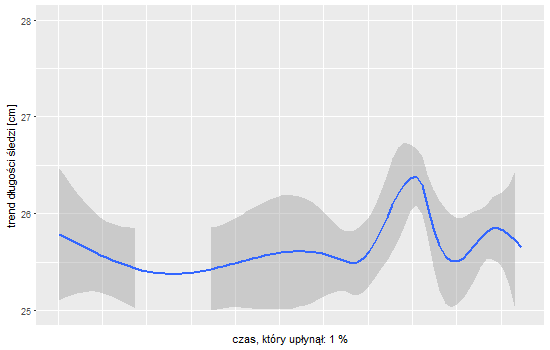

```{r setup, include=FALSE}
knitr::opts_chunk$set(echo = TRUE)

```

<style>
  .heightfix p {height:500px !important;}
  .col2 {
    columns: 2 200px;         /* number of columns and width in pixels*/
    -webkit-columns: 2 200px; /* chrome, safari */
    -moz-columns: 2 200px;    /* firefox */
  }
  .col3 {
    columns: 3 100px;
    -webkit-columns: 3 100px;
    -moz-columns: 3 100px;
  }
</style>

---
title: "Analiza długości śledzia oceanicznego - raport eksploracji danych"
author: "Marcin Zabłocki"
date: `r format(Sys.Date(),format="%d %B %Y")`
output: html_document
---

## Streszczenie

Obiektem analizy był zbiór danych dotyczących połowu śledzia oceanicznego. Dane zwierały ponad 50 tysięcy wpisów zebranych na przestrzenii około 60 lat. Podczas analizy zbioru zauważono, że od pewnego momentu długość śledzi zaczęła regularnie spadać. Po wstępnym oczyszczeniu danych i usunięciu z nich trywialnych zależności, wykorzystano algorytm uczenia maszynowego *eXtreme Gradient Boosting* i wykryto, że główną przyczyną tego zjawiska jest utrzymujący się wzrost temperatury przy powierzchni wody. 

## Użyte biblioteki R
```{r load_libraries, warning=F, error=F, message=F}
library(dplyr)
library(ggplot2)
library(grid)
library(gridExtra)
library(reshape2)
library(caret)
library(knitr)
library(plotly)
```

## Powtarzalność wyników
```{r set_seed}
set.seed(666)
```

## Zbiór danych
Dane zostały wczytane z pliku CSV. Brakujące wartości oznaczone były znakiem `?`, który zamienono na wartość *NA*.

```{r load_data}
data <- read.csv("sledzie.csv")
data[data=="?"] <- NA
data <- mutate_all(data, as.numeric)
completeData <- data[complete.cases(data),]
```

Zbiór danych zawierał `r nrow(data)` wpisów, każdy z nich opisany był przez `r length(colnames(data))` atrybutów numerycznych, w tym jedną kolumnę identyfikatora, porządkującą zbiór chronologicznie. 

### Opis atrybtów

* **length**: długość złowionego śledzia [cm],
* **cfin1**: dostępność planktonu [zagęszczenie Calanus finmarchicus gat. 1],
* **cfin2**: dostępność planktonu [zagęszczenie Calanus finmarchicus gat. 2],
* **chel1**: dostępność planktonu [zagęszczenie Calanus helgolandicus gat. 1],
* **chel2**: dostępność planktonu [zagęszczenie Calanus helgolandicus gat. 2],
* **lcop1**: dostępność planktonu [zagęszczenie widłonogów gat. 1],
* **lcop2**: dostępność planktonu [zagęszczenie widłonogów gat. 2],
* **fbar**: natężenie połowów w regionie [ułamek pozostawionego narybku],
* **recr**: roczny narybek [liczba śledzi],
* **cumf**: łączne roczne natężenie połowów w regionie [ułamek pozostawionego narybku],
* **totaln**: łączna liczba ryb złowionych w ramach połowu [liczba śledzi],
* **sst**: temperatura przy powierzchni wody [°C],
* **sal**: poziom zasolenia wody [Knudsen ppt],
* **xmonth**: miesiąc połowu [numer miesiąca],
* **nao**: oscylacja północnoatlantycka [mb]


### Podstawowa charakterystyka
Krótkie podsumowanie najważniejszych statystyk dla każdego z atrybutów (wyłączono atrybut identyfikatora X).
```{r summary_of_data}
knitr::kable(summary(data[,2:9]))
knitr::kable(summary(data[,10:16]))
```

## Wstępne przetwarzanie
### Brakujące wartości
Pomimo dużej liczby danych w zbiorze, ich zróżnicowanie było bardzo niewielkie. Wynikało to z faktu, że w większości atrybuty opisują wartości mierzone w oknie rocznym (dla danego roku parametry się nie zmieniają). Brakujące wartości w odpowiednich kolumnach zostały zastąpione wartościami z odpowiednich kolumn pełnych rekordów, w których wartość atrybutu *recr* była taka sama (atrybut ten opisuje _roczny_ narybek, więc dla danego roku jest on stały).

W celu przyśpieszenia wyszukiwania odpowiednich wartości zastępujących, dane zostały pogrupowane wzlędem kolumny recr, a następnie umieszczone w tablicy haszowej. 
Przedstawiona poniżej funkcja *replace_missing* zawiera instrukcję warunkową, dla przypadku, gdy dany rekord nie ma atrybutu *length* - ten przypadek jest zastępowany średnią długością z danego roku i miesiąca. W dostarczonym ziobrze danych, taki przypadek jednak nie wystepował. 

```{r replace_missing, cache=TRUE}
replacementData <- group_by(completeData, recr) %>% filter(row_number()==1) %>% ungroup() %>% arrange(recr)
lookupReplacement <- new.env()
for(ridx in 1:nrow(replacementData)){
    key <- as.character(unlist(replacementData[ridx,"recr"]))
    lookupReplacement[[key]] <- replacementData[ridx,]
}

replace_missing <- function(dataRow) {
  recrid <- unlist(dataRow["recr"])
  replacement <- lookupReplacement[[as.character(recrid)]]
  dataRow[which(is.na(dataRow))] <- replacement[which(is.na(dataRow))]
  if(is.na(dataRow["length"])) {
    m <- unlist(dataRow["xmonth"])
    l <- unlist((filter(completeData,recr==recrid,xmonth==m) %>% group_by(recr) %>% summarize(l=mean(length)))["l"])
    dataRow["length"] <- l
  }
  
  
  dataRow
}

withMissing <- data[!complete.cases(data),]
if(nrow(withMissing) > 0){
  for(item in 1:nrow(withMissing)){
    withMissing[item,] <- replace_missing(withMissing[item,])
  }
}
```

### Normalizacja danych
Przed rozpoczęciem analizy statystycznej, dane we wszystkich kolumnach (z wyjątkiem kolumny identyfikatora *X*) zostały znormalizowane do przedziału od 0.0 do 1.0.
```{r normalize, cache=TRUE}
completeData <- arrange(merge(completeData,withMissing,all=TRUE),X) %>% mutate_all(as.numeric)
normalized <- completeData
for(col in colnames(normalized)){
  if(col == "X")next
  normalized <- mutate_(normalized,.dots=setNames(paste0("(",col,"-min(",col,"))/(max(",col,")-min(",col,"))"),col))
}
```

## Korelacja atrybutów
Korelacja pomiędzy atrybutami została sprawdzona za pomocą współczynnika korelacji Pearsona. Wykres przedstawia zależności pomiędzy atrybutami (ciemniejszy kolor, oznacza silniejszą korelację). Dla ułatwienia interpretacji, wykres przedstawia **wartości bezwzlędne współczynnika korelacji**.

Najsilniesze powiazanie występowało pomiędzy atrybutami:

* chel1 i lcop1 (korelacja dodatnia)
* chel2 i lcop2 (korelacja dodatnia)
* cumf i fbar (korelacja dodatnia)
* cumf i totaln (korelacja ujemna)

```{r corel_plot, echo=FALSE, WARNING=FALSE, cache=TRUE}
corel <- cor(select(normalized,-X))
cormat <- corel
cormat <- abs(cormat)
cormat[lower.tri(cormat)] <- NA
corelations <- melt(cormat,na.rm = TRUE)
corelPlot <- ggplot(corelations,aes(Var2,Var1, fill=value)) + scale_fill_gradient(name="współczynnik\nkorelacji\n", low="#FFC05E",high="#0089B2") + geom_tile() + theme_minimal() + coord_fixed() + labs(x="",y="") + theme(axis.text.x = element_text(angle = 90, vjust = 1,size = 12, hjust = 1))
ggplotly(corelPlot)
```

## Długość śledzi
Poniższy animowany wykres przedstawia jak zmieniał się trend długości śledzi z ubiegiem czasu - od początku do końca pomiarów. Łatwo zauważyć, po około 2/5 czasu uwzlędnionego w zbiorze nastąpiło przełamanie trendu i długość śledzi zaczeła maleć.



*Wykres został wygenerowany za pomocą kodu w komentarzu, RMarkdown miał problem z użyciem bilbioteki animate i wykres nie generował się poprawnie*

Dla łatwiejszej analizy, poniższe wykresy przedstawiają trend dla kilku kluczowych punktów:

```{r animated_plot_code, warning=FALSE, cache=TRUE, echo=T, eval=FALSE}
library(animation)
show_on<-c(20,40,60,100)
max_x <- max(completeData[,"X"])
x_es <- 1:max(max_x)
x_es <- x_es[x_es%%(floor(length(x_es)/100))==0]
trend_plots <- c()
  for(pseudo_x in x_es){
    percent <- ceiling((pseudo_x*100)/max_x)
    x_label <- paste0("czas, który upłynął: ",percent," %")
    p <- ggplot(filter(completeData, X<=pseudo_x),aes(X,length)) + 
      geom_smooth(method="gam",formula = y ~ s(x, bs = "cs")) + labs(y="trend długości śledzi [cm]",x=x_label) + 
      ylim(25,28) +
      theme( axis.ticks.x = element_blank(), axis.text.x = element_blank())
    trend_plots <- c(trend_plots, p)
    if(any(show_on==percent)){
      print(p)
    }
  }

saveGIF({
  for(idx in seq_along(trend_plots)){
    print(trend_plots[idx])
  }
}, interval = 0.2, ani.width = 550, ani.height = 350)
```

<div class="col2 heightfix">
```{r animated_plot, warning=FALSE, cache=TRUE, echo=FALSE}
library(animation)
show_on<-c(20,40,60,100)
max_x <- max(completeData[,"X"])
x_es <- 1:max(max_x)
x_es <- x_es[x_es%%(floor(length(x_es)/100))==0]
trend_plots <- c()
  for(pseudo_x in x_es){
    percent <- ceiling((pseudo_x*100)/max_x)
    x_label <- paste0("czas, który upłynął: ",percent," %")
    p <- ggplot(filter(completeData, X<=pseudo_x),aes(X,length)) + 
      geom_smooth(method="gam",formula = y ~ s(x, bs = "cs")) + labs(y="trend długości śledzi [cm]",x=x_label) + 
      ylim(25,28) +
      theme( axis.ticks.x = element_blank(), axis.text.x = element_blank())
    trend_plots <- c(trend_plots, p)
    if(any(show_on==percent)){
      print(p)
    }
  }
```
</div>


## Rozkład wartości atrybutów
Poniższe histogramy prezentują rozkłady wartości atrybutów w zbiorze. Poza atrybutem length, który charakteryzuje się rozkładem zbliżonym do rozkładu normalnego, atrybuty posiadają bardzo nieregularne rozkłady wartości, z kilkoma wartościami odstającymi. Nie pokazano rozkładu dla atrybutów *X* (identyfikator) oraz *xmonth*.

Tak jak wspomniano wcześniej (podpunkt *Brakujące Wartości*) większość atrybutów zawiera mało unikalnych wartości. Warto zwrócić uwagę na oś Y - liczba elementów, której skala rozciąga się od 0 do 6000. Dla niektórych wartości poszczególnych atrybutów, ich powtarzalność sięga prawie maksymalnej wartości tego przedziału.

<div class="col2 heightfix">
```{r distribution_plots, echo=FALSE, warning=FALSE,error=FALSE, cache=TRUE}
distributionPlots <- list()
columnNames <- colnames(completeData)
excludedColumns <- c("xmonth","X")
numberOfCharts <- 1
for(idx in seq_along(columnNames)){
  col <- columnNames[idx]
  if(length(excludedColumns[excludedColumns==col])>=1){
    next
  }
  distPlot <- (ggplot(completeData, aes_string(x=col)) + geom_histogram(bins=30,fill="#0089B2") + ylim(0,6000) + labs(y="liczba elementów") + theme_minimal())
  distributionPlots[[numberOfCharts]] <- distPlot
  numberOfCharts <- numberOfCharts+1
  print(distPlot)
  
}

```
</div>

## Model predykcyjny
Przed rozpoczęciem trenowania modelu, dane zostały znormalizowane do przedziału od 0.0 do 1.0 (wszystkie atrybuty, z wyjątkiem długości - length, który zachował oryginalne wartości). Usunięto również atrybuty o silnej korelacji (na podstawie analizy opisanej wcześniej). Usunięte atrybuty to: **chel1, chel2, cumf** oraz **X** (kolumna identyfikatora).

Zbiór został podzielony na treningowy i testujący w stosunku odpowiednio 7:3, przy czym zastosowano losowanie warstowe, zachowujące rozkład wartości atrybutu **length**.
Po wielu eksperymentach, najlepiej ocenianym modelem predykcyjnym okazał się **eXtreme Gradient Boosting**. Jego parametry zostały dobrane za pomocą metody kroswalidacji.

```{r remove_corelated, cache=FALSE}
withoutCorelated <- select(normalized,-chel1,-chel2,-cumf, -X)
```

```{r, cache=TRUE, warning=FALSE}
herrings <- withoutCorelated
herrings[["length"]] <- completeData[["length"]]
inTraining <- createDataPartition(herrings$length, p=0.7, list=FALSE)
training <- herrings[inTraining,]
testing <- herrings[-inTraining,]
ctrl <- trainControl(method="repeatedcv",number=3,repeats=3)
model <- train(length ~ .,data = training, method="xgbLinear", trControl=ctrl)

```

Najlepsze parametry oraz miary oceny dla zbioru treningowego:

```{r}
b<-model$bestTune
kable(b)
best<-filter(model$results,nrounds==b$nrounds&lambda==b$lambda&alpha==b$alpha&eta==b$eta)
kable(select(best,RMSE,Rsquared))
```

Na danych testowych model uzyskał następujące miary:

```{r message=FALSE,warning=FALSE,error=FALSE}
predictions <- testing
predictions[["predicted"]] <- predict(model, newdata=testing)
rmse_testing <- sqrt(mean((predictions$length-predictions$predicted)^2))
ss_res<-sum((predictions$length-predictions$predicted)^2)
ss_tot<-sum((predictions$length-mean(predictions$length))^2)
rsq_testing <- 1 - (ss_res/ss_tot)
kable(data.frame("RMSE"=rmse_testing,"Rsquared"=rsq_testing))
p <- ggplot(predictions,aes(length,predicted)) + geom_point() + geom_smooth(method="glm") + labs(y="długość przewidziana przez model [cm]",x="rzeczywista długość [cm]") + xlim(19,32.5) + ylim(19,32.5)  + theme_minimal()
ggplotly(p)
```

## Istotność atrybutów
Ranking ważności atrybutów dla zbudowanego modelu regresji przedstawia się następująco:

```{r}
importance <- varImp(model)
ggplot(importance,aes(Overall)) + geom_bar(stat="identity",fill="#0089B2") + theme_minimal() + labs(y="ważność", x="atrybut",title="Ranking atrybutów")
```

Najważniejszym atrybutem okazal się **sst**, oznacza to, że głownym czynnikiem wpływającym na długość śledzia jest temperatura przy powierzchni wody. W początkowym okresie, gdy temperatura spadała, średnia długość śledzi wzrastała. Po osiągnięciu minimum temperatury, zaczęła ona dość gwałtownie rosnąć i od tego samego punktu, długość śledzia zaczęła nieustannie maleć. Na poniższym wykresie można zauwazyć nietrywialną korelację pomiędzy tymi atrybutami:

```{r sst_corelation, warning=F,error=F,message=F}
ggplot(normalized,aes(X,sst)) + geom_smooth(aes(X,sst,colour="temperatura (sst)")) + geom_smooth(mapping=aes(X,length,colour="długość śledzia")) + labs(title="Korelacja sst i length", y="znormalizowana wartość",x="czas") + theme(legend.text =element_text("atrybut")) + scale_colour_manual("",values=c("#0089B2","red")) + theme_minimal() +  theme(legend.position = "bottom")
```

Pozostałe atrybuty o wiele mniej wpływały na długość śledzi, jednak na niektórych z nich (np. dostępnośc planktonu) można również zauważyć korelację ich trendu względem długości śledzi.

```{r warning=FALSE, echo=F, error=F,message=F}
ggplot(normalized,aes(X,lcop1)) + geom_smooth(aes(X,lcop1,colour="dostępność planktonu (lcop1)")) + geom_smooth(mapping=aes(X,length,colour="długość śledzia")) + labs(title="Korelacja lcop1 i length", y="znormalizowana wartość",x="czas") + theme(legend.text =element_text("atrybut")) + scale_colour_manual("",values=c("#0089B2","red")) + theme_minimal() +  theme(legend.position = "bottom")
```

<div class="col2 heightfix">
```{r other_corelations_from_model, warning=F, echo=F,error=F, message=F}
ggplot(normalized,aes(X,recr)) + geom_smooth(aes(X,recr,colour="roczny narybek (recr)")) + geom_smooth(mapping=aes(X,length,colour="długość śledzia")) + labs(title="Korelacja recr i length", y="znormalizowana wartość",x="czas") + theme(legend.text =element_text("atrybut")) + scale_colour_manual("",values=c("#0089B2","red")) + theme_minimal() +  theme(legend.position = "bottom")

ggplot(normalized,aes(X,totaln)) + geom_smooth(aes(X,totaln,colour="liczba złowionych podczas połowu (totaln)")) + geom_smooth(mapping=aes(X,length,colour="długość śledzia")) + labs(title="Korelacja totaln i length", y="znormalizowana wartość",x="czas") + theme(legend.text =element_text("atrybut")) + scale_colour_manual("",values=c("#0089B2","red")) + theme_minimal() +  theme(legend.position = "bottom")

```
</div>


## Alternatywny model
Po odkryciu wspomnianych zależności, usunięto 4 najważniejsze atrybuty ze zbioru (sst, recr, totaln, lcop1), aby sprawdzić, jak zachowa się model. Okazało się, że zbudowany model ma bardzo zbliżoną jakość, pomimo wydawałoby się "trudniejszego" zbioru danych.
Tym razem, ważność atrybutów jest nieco bardziej zbilansowana - poza najistotniejszym - natężeniu połowów (fbar), atrybuty sal, nao oraz cfin1 są na podobnym poziomie istotności. 
```{r echo=T, warning=F, error=F}
herrings2 <- select(withoutCorelated,-lcop1, -sst, -totaln, -recr)
herrings2[["length"]] <- completeData[["length"]]
```

```{r model_2, cache=TRUE, warning=FALSE, echo=T}
inTraining2 <- createDataPartition(herrings2$length,p=0.7,list=FALSE)
training2 <- herrings2[inTraining2,]
testing2 <- herrings2[-inTraining2,]
ctrl <- trainControl(method="repeatedcv",number=3,repeats=3)
model2 <- train(length ~ .,data = training2, method="xgbLinear", trControl=ctrl)
predictions2 <- testing2
predictions2[["predicted"]] <- predict(model2, newdata=testing2)
rmse_testing2 <- sqrt(mean((predictions2$length-predictions2$predicted)^2))
ss_res2<-sum((predictions2$length-predictions2$predicted)^2)
ss_tot2<-sum((predictions2$length-mean(predictions2$length))^2)
rsq_testing2 <- 1 - (ss_res2/ss_tot2)

```

```{r}
importance2 <- varImp(model2)
ggplot(importance2,aes(Overall)) + geom_bar(stat="identity",fill="#0089B2") + theme_minimal() + labs(x="atrybut", y="ważność",title="Ranking atrybutów modelu alternatywnego")
```

Wskaźniki dla alternatywnego modelu dla danych treningowych:

```{r, echo=F}
b2<-model2$bestTune
best2<-filter(model$results,nrounds==b$nrounds&lambda==b$lambda&alpha==b$alpha&eta==b$eta)
kable(data.frame("RMSE"=rmse_testing2,"Rsquared"=rsq_testing2))
```

oraz testowych:

```{r, echo=F}
kable(select(best,RMSE,Rsquared))
```

## Podsumowanie
Wejściowy zbiór danych okazał się dość trudny w przetwarzaniu. Dla wielu różnych długości śledzia, wszystkie pozostałe atrybuty posiadały te same wartości, co przyczyniło się do dużych odchyleń w wartościach przewidywanych przez budowane modele predykcyjne.

W trakcie analizy, zgodnie z podanymi informacjami, traktowano *X* jako atrybut wskazujący na czas, pomimo braku jednostki i jego niespójności ze zmianami wartości atrybutu *xmonth*. Przy analizie tego typu danych wejściowych, warto poprosić dostawcę danych o przekazanie dodatkowych atrybutów, jeżeli jest taka możliwość. 

*Wygenerowanie całego raportu od podstaw zajmuje około 5 minut na procesorze i5 @ 1.8GHz*